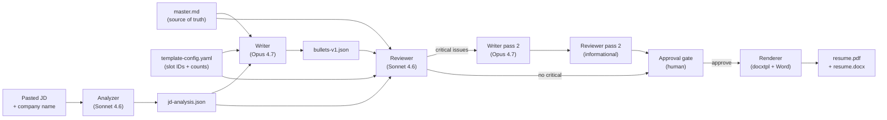

# stitch

A source-grounded, three-agent resume tailoring pipeline. Takes a pasted job description, produces a `.docx` + `.pdf` resume tailored from a personal `master.md` — with a reviewer agent that catches fabricated metrics and missing JD keywords before render.

Built to solve a real problem: most AI resume tools hallucinate. This one structurally can't, because every bullet must trace back to a verbatim claim in `master.md`, and an independent reviewer agent flags any bullet that doesn't.

## Architecture



Six explicit stages, isolated per-company in `.tmp/<slug>/`. No agent ever overwrites another company's run.

## Why this design

Three principles drove every architectural choice:

1. **Source fidelity.** Every bullet must be backed by a verbatim claim in `master.md`. The writer cannot invent metrics, technologies, scope, or outcomes. The reviewer's `fabrication` check is the strictest gate in the pipeline.
2. **Slot-id binding.** Master sections are tagged with their slot ID in square brackets (`## Role [ai_engineer]: ...`). The writer reads only the `[ai_engineer]`-tagged section's prose to fill the `ai_engineer` slot — no cross-section guessing.
3. **Severity-tiered review.** Critical issues (fabrication, invalid IDs, JD irrelevance) trigger one revision pass. Minor issues (phrasing, missed keywords, formula violations) are reported but never loop. Caps token spend; eliminates infinite loops.

Bullets must follow a mandatory structural formula:

```
[Strong verb] + [specific artifact + tech] + [measurable result OR concrete scope] + [optional method]
```

A 13-phrase banned-start blocklist (`Worked on`, `Responsible for`, `Helped with`, etc.) and a 20-30 word length cap are enforced by the reviewer, not the writer — so format compliance is auditable separately from content quality.

## Two ways to run it

**Standalone Python (works without Claude Code):**

```bash
python -m stitch --company "Acme Corp" --jd ./jd.txt
```

**Claude Code skill (in this project's directory):**

```
/stitch
```

Both modes share the same prompts (`prompts/analyzer.md`, `prompts/writer.md`, `prompts/reviewer.md`), the same `template-config.yaml`, the same `master.md`, and the same renderer (`scripts/fill_and_render.py`). Only the orchestration layer differs:
- Standalone: `src/stitch/pipeline.py` calls the Anthropic SDK directly.
- Claude Code: `SKILL.md` instructs parent Claude to spawn Task subagents.

## Install

Requires Python 3.11+ and Microsoft Word (for PDF rendering on Windows via docx2pdf).

```bash
pip install -e .              # installs the package + deps

# Auth — pick ONE of:
claude setup-token            # generate a long-lived OAuth token, then:
export ANTHROPIC_AUTH_TOKEN=sk-ant-oat-...   # bills against Claude Code subscription
# -- or --
export ANTHROPIC_API_KEY=sk-ant-api-...      # direct API billing
```

**OAuth is recommended.** `claude setup-token` generates a long-lived token tied to your Claude Code subscription — runs cost nothing extra beyond what you already pay for Claude Code. The API key path bills metered tokens (~$0.06–0.15/run) directly to your Anthropic account. If you're invoking via the Claude Code skill (`/stitch`) instead of the standalone CLI, neither env var is needed — parent Claude's session auth is used automatically.

### Personal data: copy from `*.example.*` templates

The repo ships skeleton/example versions of every personal-data file. Copy them once, then edit your real ones (which are gitignored — never committed):

```bash
cp master.example.md          master.md
cp template-config.example.yaml  template-config.yaml
python scripts/setup.py       # generates a placeholder template.docx
                              # (refuses to overwrite if one already exists)
```

Then customize each:
1. **`master.md`** — your full career narrative as H2 sections tagged `[<slot_id>]`. Every claim the writer can use must live here. See `master.example.md` for the structure.
2. **`template.docx`** — your polished resume with docxtpl Jinja slots. Each bullet list needs three paragraphs: `` / `{{b}}` (List Bullet style) / ``. The setup script generates a minimal placeholder you can replace with your real .docx (keeping the slot syntax).
3. **`template-config.yaml`** — declares slot IDs and per-slot bullet counts. IDs must match both `[<id>]` tags in master.md AND `<id>_bullets` loops in template.docx.

`.gitignore` keeps `master.md`, `template.docx`, `templt.docx`, `template-config.yaml`, `.tmp/`, and `out/` out of version control so your personal data stays local.

## Tests

```bash
pip install -e ".[dev]"
pytest
```

Covers: slugify normalization (12 cases), JSON-extraction lenient parsing + retry, slot validation in `build_context()`, `has_critical_issues()` branching.

## Eval

Two scripts compute objective metrics on a pipeline run's output:

```bash
python -m eval.atom_grounding .tmp/acme/bullets-v1.json master.md
python -m eval.jd_coverage    .tmp/acme/bullets-v1.json .tmp/acme/jd-analysis.json
```

- **`atom_grounding.py`** — extracts numbers + tech names + proper nouns from each bullet, checks each appears verbatim in master.md. Score = grounded / total. Target ≥ 95%. This is the closest mechanical proxy to "did the writer hallucinate?"
- **`jd_coverage.py`** — what fraction of the JD's required_skills, preferred_skills, and keywords_to_emphasize actually appear in the rendered resume? Required ≥ 80%, keywords ≥ 50%.

Sample fixture in [eval/fixtures/sample-jd-ai-engineer.txt](eval/fixtures/sample-jd-ai-engineer.txt).

## Project layout

```
src/stitch/
  pipeline.py            6-stage orchestrator (standalone equivalent of SKILL.md)
  stages.py              analyzer / writer / reviewer stage helpers
  anthropic_client.py    SDK wrapper (prompt caching, JSON-extraction, retry)
  slugify.py             company name → filesystem-safe slug
  cli.py                 argparse entry: `python -m stitch`
.claude/                 Claude Code skill (alternative orchestrator)
  skills/stitch/
    SKILL.md             stage-by-stage instructions for parent Claude
    prompts/
      analyzer.md        Sonnet — extracts ATS schema from JD
      writer.md          Opus   — produces bullets + skills (formula-enforced)
      reviewer.md        Sonnet — audits for fabrication + JD relevance + formula
scripts/
  setup.py               first-run scaffolder (refuses to overwrite)
  fill_and_render.py     docxtpl fill + docx2pdf render
tests/                   pytest suite
eval/                    atom_grounding + jd_coverage + sample JDs
master.md                YOUR career narrative (gitignored — personal data)
template.docx            YOUR polished resume + Jinja slots (gitignored)
template-config.yaml     slot IDs + bullet counts
out/<company>-<date>/    final resume.docx + resume.pdf + bullets.json + jd.txt
```

## Stack

| Component | Why |
|---|---|
| **Anthropic Claude (Sonnet 4.6 + Opus 4.7)** | Sonnet for extraction & audit (deterministic), Opus for the one creative step (writing bullets) where quality matters most. Both modes use identical prompts. |
| **Prompt caching** | System prompts (analyzer/writer/reviewer .md files) are reused across stages → cached with `cache_control: ephemeral`, ~90% input cost reduction on cache hits. |
| **docxtpl + python-docx** | Jinja2 templating inside .docx. Preserves your polished Word formatting; only the dynamic regions (bullets + skills) get filled. |
| **docx2pdf + pywin32** | Renders via Microsoft Word COM. Pixel-perfect match to what Word produces — no LaTeX surprises, no LibreOffice layout drift. |
| **PyYAML** | Single-file slot config. |
| **pytest** | Validates slot ID matching, JSON parsing edge cases, and revision-loop branching without hitting the API. |

## Status

This is a personal tool, polished into a portfolio project. The `OPTIONC` branch was the standalone-Python port; main is the original Claude Code skill version. Both work.

If you want to actually use it: clone, `pip install -e .`, run `scripts/setup.py`, fill in your `master.md`, customize `template.docx`, and run.

## License

MIT.
